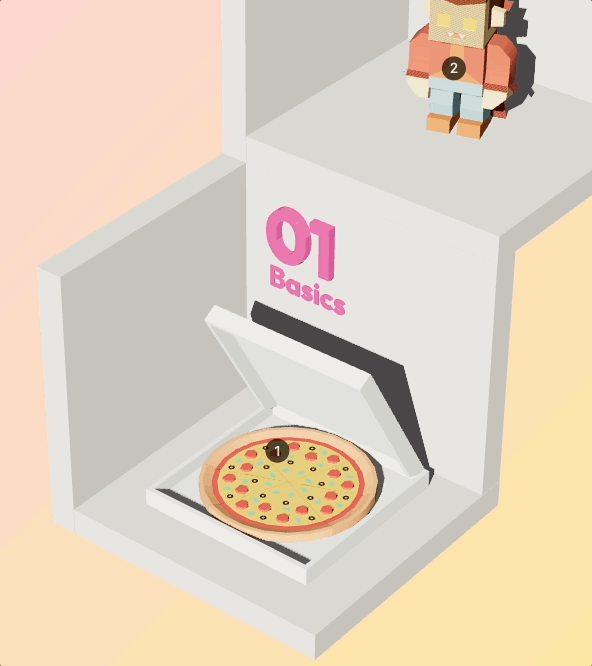

# 3 Rooms Three.js Scene

A small 3D showcase, written after completing 50% of [Bruno Simon's](https://twitter.com/bruno_simon) excellent course on ThreeJS. Written with [React-Three-Fiber](https://github.com/pmndrs/react-three-fiber), 3D models from [kenney.nl](https://kenney.nl).

The scene is inspired by the **3D course overview** from [threejs-journey.com](https://threejs-journey.com/).



## Live Demo

Head over to https://demo-threejs-fiber-rooms.vercel.app/ to see the project live.

## Running locally

First, install the dependencies:

```bash
npm i
```

Then, run the development server:

```bash
npm run dev
```

Open [http://localhost:5173](http://localhost:5173) with your browser to see the result.
